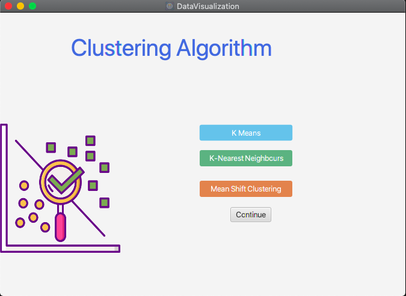
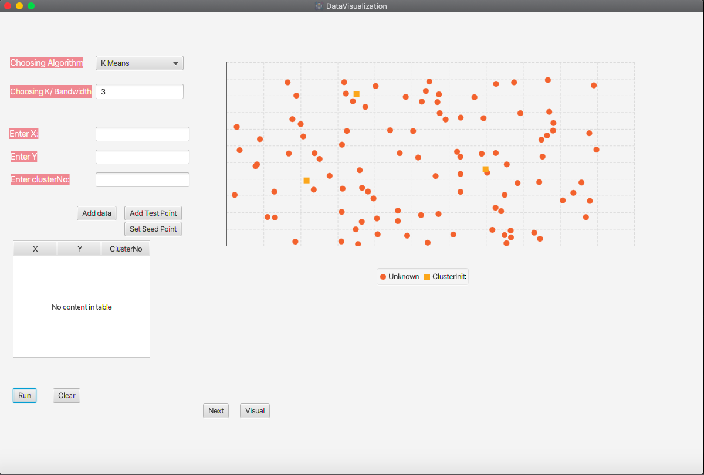
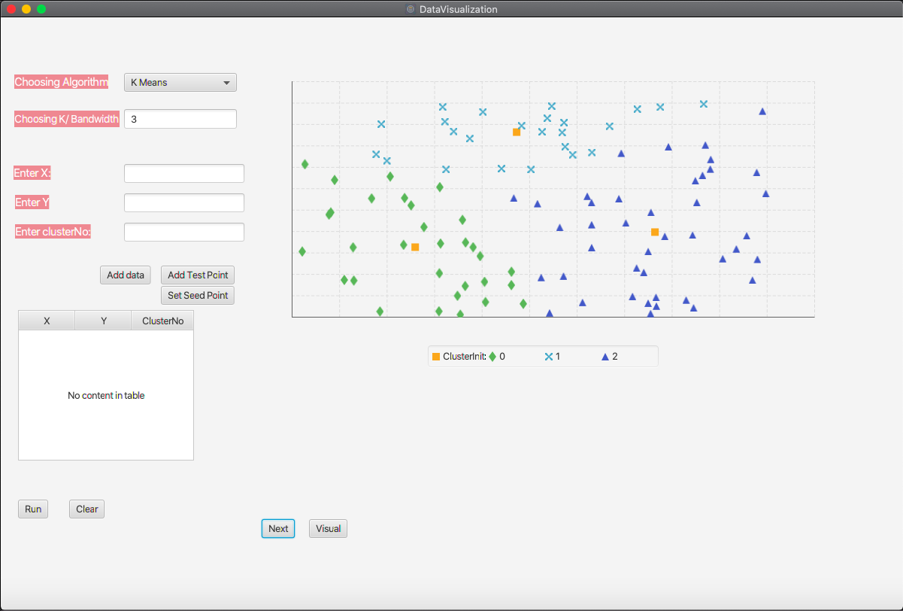
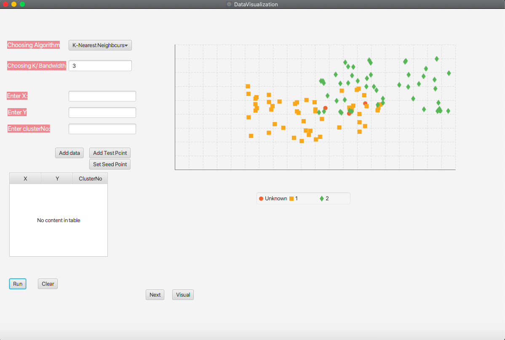
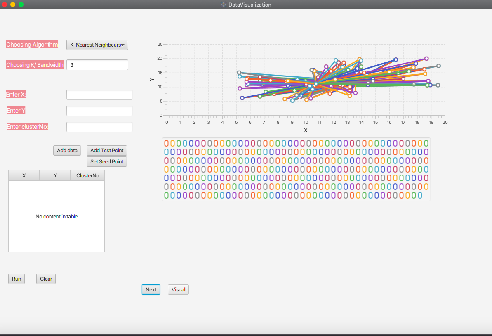

# SEproject-Clustering
Clustering is the task of dividing the population or data points into a number of groups such that data points in the same groups are more similar to other data points in the same group than those in other groups. In simple words, the aim is to segregate groups with similar traits and assign them into clusters.

## 1. Introduction 
- **Members**

| |Full Name|Student ID|
|:--:|:--|:--:|
| 1 | [Dinh The Kiet](https://github.com/Overleaff) | 20194783 |
| 2 | [Ho Tran Anh Vu](https://github.com/anhvu2501) | 20194885 |
| 3 | [Dang Quoc Tu](https://github.com/Fizz-b) | 20194871 |

- **Including**: 
  - Kmeans Clustering
  - Mean shift Clustering
  - K-nearest neighbor Clustering

## 2. Gui and Algorithm
### Gui Initialization

### Algorithm
- **1. Kmeans clustering**
A cluster refers to a collection of data points aggregated together because of certain similarities.
In other words, the K-means algorithm identifies k number of centroids, and then allocates every data point to the nearest cluster, while keeping the centroids as small as possible.
To process the learning data, the K-means algorithm in data mining starts with a first group of randomly selected centroids, which are used as the beginning points for every cluster, and then performs iterative (repetitive) calculations to optimize the positions of the centroids

  Init data test data set and 3 centroids for Kmeans Clustering

  Data test set is clustered based on initial centroid

The centroid must be updated and the data is again clustered based on our new centroids
   

- **2. K-nearest neighbor clustering**
The k-nearest neighbors (KNN) algorithm is a simple, supervised machine learning algorithm that can be used to solve both classification and regression problems. It’s easy to implement and understand, but has a major drawback of becoming significantly slows as the size of that data in use grows.
To process, the Knn clustering algorithm starts with a labeled data set and the number of test points k.

  Init labeled data set and 3 test points for Knn Clustering

Calculate the distance between the query example and the current example from the data

The largest number of points which are near the test point define the cluster the point belongs to.

